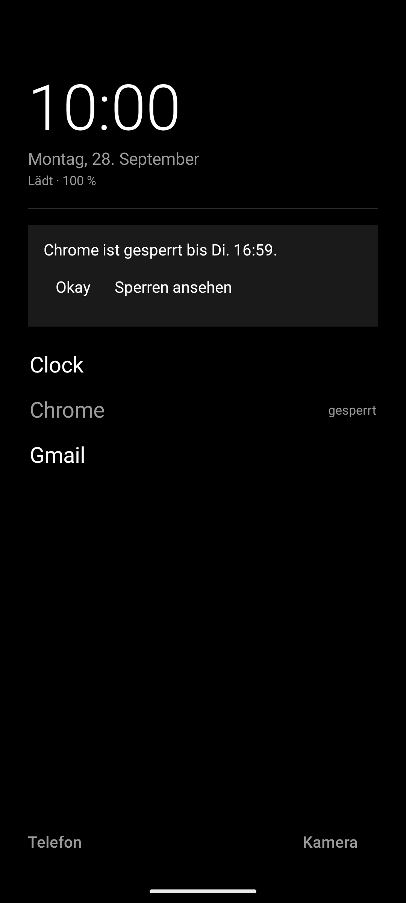
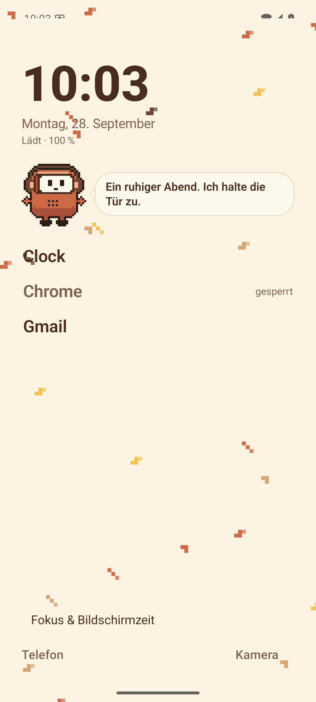

# Hush

A quiet Android launcher. Clock, date, your apps as a text list. Optional focus tools: app
blocks, recurring focus schedules, daily usage reminders, a notification filter and a brake
for Shorts and Reels. Two looks: **Minimal** (black, white, nothing else) and **Cozy** (cream,
terracotta, sage, Nunito, and Mr. Nook the pixel robot who says one line per hour).

Everything stays on the device. Hush has no internet permission.

 

## What it does

- Real HOME launcher: default-launcher role, all launchable apps incl. work profile, live
  updates on install / uninstall / rename, survives reboot and process death.
- Home: big clock, date, charging line, vertical favourites, Phone / Camera / Alarm quick
  actions, long press on free space opens settings.
- Drawer: search with ranking (prefix, word start, substring), A–Z index, folders, hidden
  apps, custom names, keyboard auto-open (optional), Enter launches the first hit.
- Context menu: open, favourite, rename, hide, folder, usage reminder, block, app info,
  uninstall.
- Blocking: 1 h to 30 d on a log slider, slide to confirm. Enforced by the accessibility
  service when enabled, otherwise shown in the launcher only. The UI says which one applies.
- Schedules: name, weekdays, start / end (overnight allowed), several apps, on / off.
- Usage reminders: daily minutes per app, notification at 80 % and 100 %. Never a block.
- Screen time: today, last 7 days, per app, most used. Needs Usage Access.
- Notification filter: block list or allow list per rule, time window, weekdays. Matches are
  logged locally (30 days) and removed from the shade.
- Short video brake: YouTube Shorts, Instagram Reels, Facebook Reels, Snapchat Spotlight.
  Heuristic on view ids, documented as such.
- Gestures: swipe up, swipe down, double tap, each assignable. Lock screen and notification
  shade go through the accessibility service.
- Appearance: Minimal / Cozy, Cozy light / dark / auto, four font sizes, three fonts,
  wallpaper, reduced motion, and pixel scenes (leaves, snow, rain, fireflies, stars, petals)
  with three densities.

See `FEATURES.md` for the per-feature status, `PERMISSIONS.md` for what each permission
does, `ARCHITECTURE.md` for the module layout, `BUILD.md` for building, `TEST_RESULTS.md`
for what was verified and how.

## Relation to Melinda and Mr. Nook

Both are web apps (Cloudflare Workers, vanilla JS). Nothing of their code runs here. Hush
takes their CSS colour tokens for Cozy Mode, the Nunito font, the tone of voice, and Mr.
Nook's sprite sheets (idle, talk, sleep, cheer) as the mascot. There is no data exchange
and no deep integration; that was decided on 2026-09-28.

## Status

Version 0.1.1, debug build verified on an Android 15 emulator (Pixel 6 profile) after a
three-lens code review (crash/lifecycle, services, UX). Not on the Play Store. Private
repository. Not yet tested on a physical phone.

## Licences

Nunito: SIL Open Font License 1.1, see `licenses/nunito-OFL.txt`. Mr. Nook artwork:
© nzrbits, from the Mr. Nook project.
